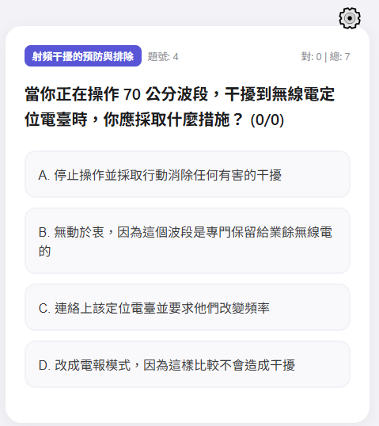
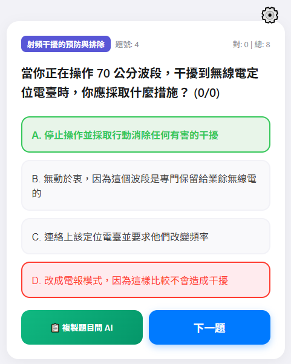
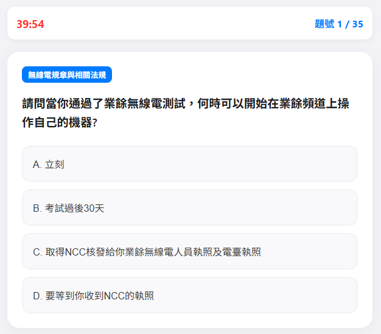
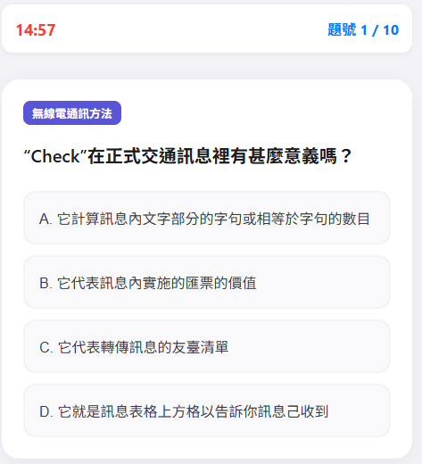
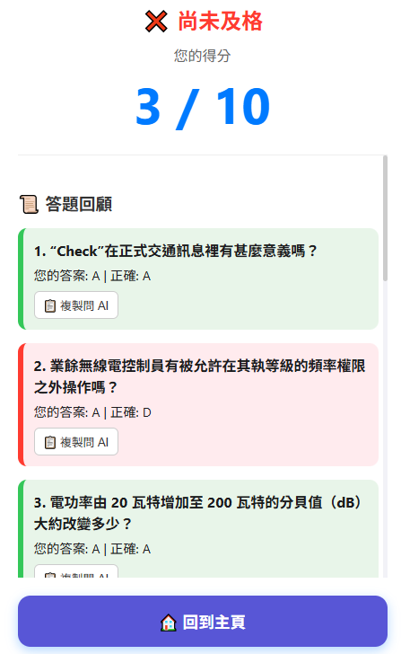
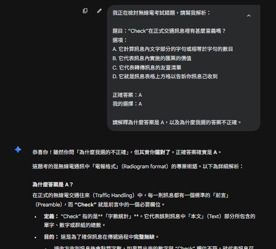

# 業餘無線電三等考試練習系統

準備業餘無線電三等執照考試時，找不到一個介面順手、又能針對弱點練習的工具。
現有的系統大多只有題目和答案，碰到法規或電路題看完答案還是不懂為什麼。

所以我決定自己做一個，順便把一直想練的 PHP + MySQL 全端開發實際跑一遍。
這是我第一個從需求、設計到上線都獨立完成的 Web 專案。

---

## 功能說明

**單題練習模式**

- 作答後立即顯示正確答案並記錄對錯
- 可勾選六大分類做針對性練習
- 弱點模式：自動優先出現曾答錯的題目




**模擬測驗模式**

- 支援 15 題速測、35 題全真模考、自訂題數與時間
- 倒數計時模擬真實考場壓力
- 考後自動計算分數（及格標準 71.4%）並列出錯題清單





**AI 解析輔助**

- 一鍵複製題目、選項、作答與正確答案，生成可直接貼給 AI 的 Prompt
- 針對行動裝置優化複製邏輯



---

## 開發過程遇到的問題

**弱點模式的篩選邏輯**
一開始用 Session 記錄答錯題號，但重新整理後資料就消失了。
後來改用資料庫記錄每題的答對／答錯次數，弱點模式才真正能跨次練習累積。

**SQL 注入防護**
開發初期沒有特別處理 API 的輸入參數，後來補上過濾後發現原本的寫法確實有漏洞。
這讓我意識到「能跑」和「安全」是兩件事，之後開發都把這個列為基本要求。

**行動裝置的複製行為不一致**
桌機用 `navigator.clipboard.writeText()` 沒問題，手機上有些瀏覽器會拒絕執行。
查了文件後改用 fallback 的 `document.execCommand('copy')`，才在各裝置上都正常。

---

## 專案架構

```text
/radio_part3_web/
├── index.php             # 練習模式
├── exam.php              # 模擬測驗
├── api/
│   ├── get_question.php
│   ├── get_exam.php
│   └── record_answer.php
├── assets/
│   ├── css/
│   ├── js/
│   └── images/
├── config/
│   └── db.php
└── data/
    └── questions.sql.bak
```

## 題庫擴充說明

題庫儲存於 MySQL 資料庫的 `questions` 資料表，需要新增或修改題目時，
直接對該資料表操作即可，不需要修改任何程式碼。

### 資料表結構

| 欄位 | 類型 | 說明 |
|------|------|------|
| `id` | int | 主鍵，自動遞增，不需手動填寫 |
| `q_num` | varchar(10) | 題號，如 `A001`、`B032` |
| `category` | varchar(100) | 題目分類，對應練習模式的分類篩選 |
| `question` | text | 題目文字內容 |
| `image` | varchar(255) | 附圖檔名，無附圖則填 `NULL` |
| `option_a` | text | 選項 A |
| `option_b` | text | 選項 B |
| `option_c` | text | 選項 C |
| `option_d` | text | 選項 D |
| `answer` | char(1) | 正確答案，填入 `A` / `B` / `C` / `D` |

---

## 更換題庫

本系統的題庫與程式碼完全分離，只要替換資料庫內容，
可改為練習其他證照（如乙級技術士、iPAS 等）。

### 步驟

**1. 清空現有題庫**

```sql
TRUNCATE TABLE questions;
TRUNCATE TABLE question_stats;
```

**2. 匯入新題庫**

依照以下格式整理新題目後匯入：
```sql
INSERT INTO questions (q_num, category, question, image, option_a, option_b, option_c, option_d, answer)
VALUES (
  'A001',          -- 題號
  '你的分類名稱',   -- 分類（可自訂，對應篩選選項）
  '題目內容',
  NULL,            -- 無附圖填 NULL，有附圖填檔名如 't1.png'
  '選項 A',
  '選項 B',
  '選項 C',
  '選項 D',
  'A'              -- 正確答案，填 A / B / C / D
);
```

**3. 更新前端的分類選項**

目前業餘無線電題庫的分類為：
- 無線電規章與相關法規
- 無線電通訊方法
- 無線電系統原理
- 無線電相關安全防護
- 電磁相容性技術
- 射頻干擾的預防與排除

換成其他題庫後，需修改 `assets/js/script.js` 中的分類清單，
將上述名稱改為新題庫的分類名稱，確保篩選功能正常顯示。

**4. 有附圖的題目**

將圖片放入 `assets/images/`，`image` 欄位填入對應檔名即可。

### 模擬測驗及格標準

目前及格標準為 **71.4%**（業餘無線電三等 35 題需答對 25 題）。
若新題庫的及格標準不同，請修改 `assets/js/exam.js` 中的 `PASS_RATE` 變數。

---

## 安全性

- `.htaccess` 禁止目錄列出
- `config/` 與 `data/` 完全禁止外部存取
- 資料庫連線關閉詳細錯誤顯示
- API 輸入參數全數過濾，防止 SQL 注入

---

## 環境需求與安裝

**環境**：Apache + PHP 7.0+ + MySQL / MariaDB

**安裝步驟**

1. 上傳所有檔案至伺服器目錄
2. 建立資料庫 `quiz_db`
3. 匯入 `data/questions.sql.bak`
4. 修改 `config/db.php` 的帳號密碼
5. 確認 `assets/images/` 的讀取權限